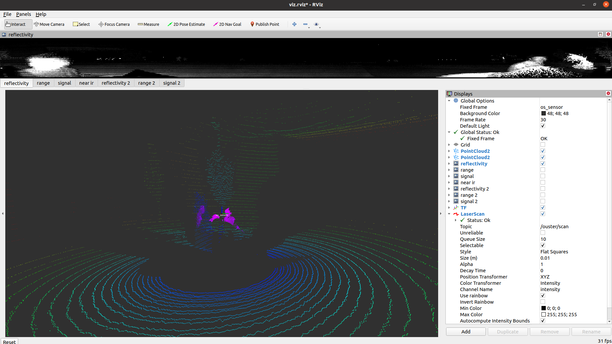
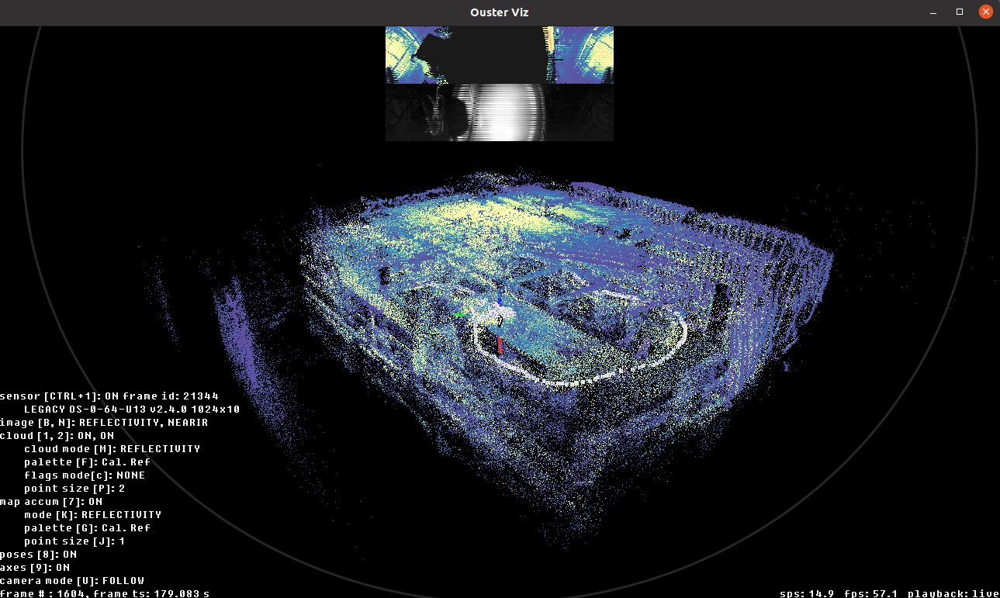
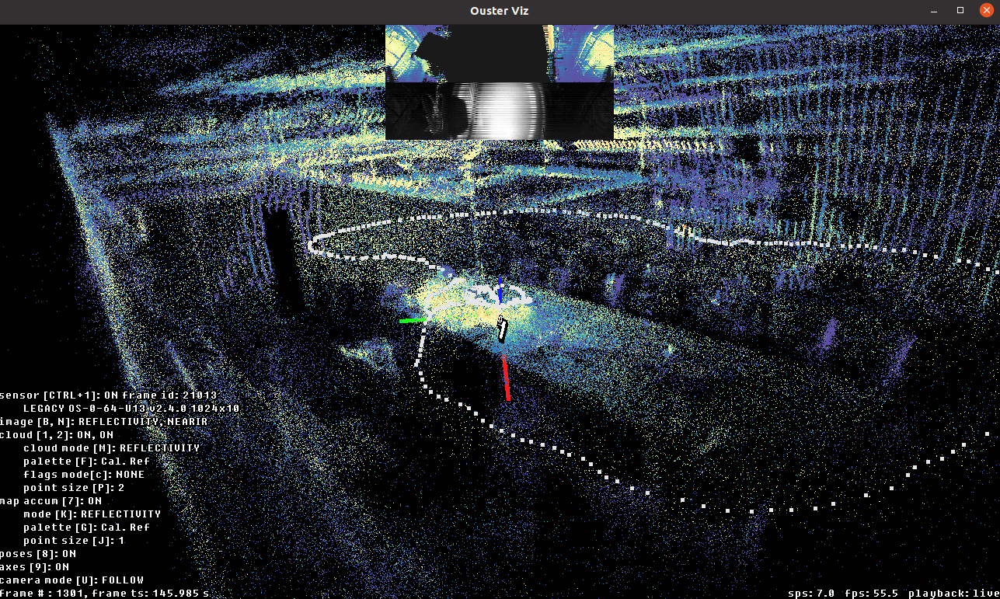
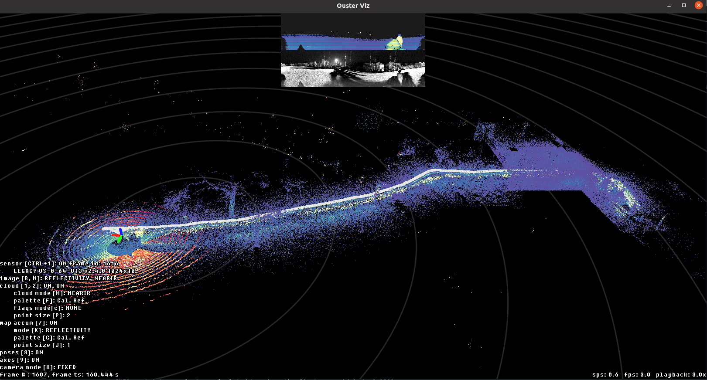
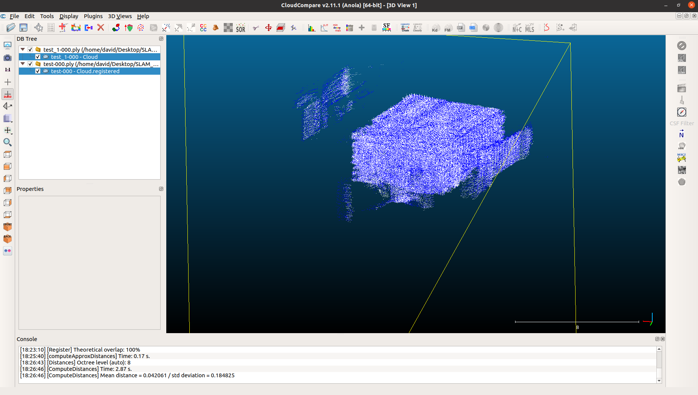
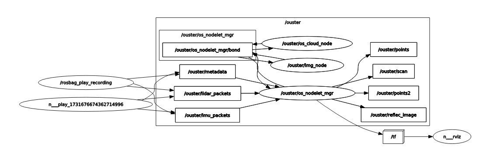

# ADD-SLAM (Adaptive Density Drive)
### Operating Ouster LiDAR (OS0 - 64) on Ubuntu 20.04.12
Adaptive Speed Optimization for SLAM Using KISS-ICP on a Rover Robot.


## 1. Ouster-SDK
### 1.1 Basic Setup
#### 1.1.1 Clone SLAM_project repository
```shell
git clone --recurse-submodules https://github.com/davidseong8914/SLAM_project.git

or

git clone https://github.com/davidseong8914/SLAM_project.git
git submodule update --init --recursive
```
#### 1.1.2 Install necessary packages
```shell
sudo apt update
sudo apt install python3.8-venv 
sudo apt install build-essential cmake libssl-dev python3-dev
pip install --upgrade pip setuptools wheel
pip install cmake
pip install ouster-sdk
pip list | grep ouster # to check ouster installation
```

### 1.2 Hardware Setup
#### 1.2.1 Ethernet Connection (1Gb)
*** On Windows - Network Settings > Automatic (DHCP)<br>
*** On Ubuntu - Network Settings > eth0: Link-Local <br>
#### 1.2.2 Power LiDAR 
- Battery (29.6V) - Converter (24V, >1000mAh + Low Voltage Buzzer) - LiDAR

### 1.3 Software Setup
```shell
# virtual environment
python3 -m venv slam_project
source slam_project/bin/activate
```
```shell
# checking ethernet connection
nmcli connection show
# expected response
Wired connection 1 ethernet enp2s0 # HAS TO BE IN GREEN
```

#### When configuring for the first time
```shell
# check LiDAR connection
ping <LiDAR IP> # this should work
# type this on the web and it should lead you to sensor information
<LiDAR IP>
# on the LiDAR information page
## Navigate to "Configurations" tab > "UDP Destination Address" > "Set Local" > "Apply Config"
```

### 1.4 Using LiDAR

#### 1.4.1 Realtime point cloud visualization
```shell
# shows realtime point cloud data
ouster-cli source <LiDAR IP> viz 
```


#### 1.4.2 ouster-sdk live SLAM
```shell
# Ouster-sdk -> slam
ouster-cli source <sensor_ip> slam viz -r0 --acum-map --accum-map-ratio 0.05

# THIS DOES KISS-ICP SLAM
~/Desktop/SLAM_project$ ouster-cli source <sensor_ip> slam viz -r1 --map

# this runs and saves as .osf (can also save as .las, .ply)
ouster-cli source <sensor_ip> slam viz save test.osf

# for SLAM_PROJECT
ouster-cli source 169.254.99.87 slam -v 0.5 viz save 1_8_2.ply
```



#### 1.4.5 ouster-sdk recorded SLAM
```shell
ouster-cli source bags/scaife_gazebo.bag slam viz -r2 --map
# r2 = point cloud playback rate

# adding voxels dramatically improve visualization
ouster-cli source bags/scaife_gazebo.bag slam -v 2.0 viz -r2 --map

# BEST PERFORMANCE FOR NOW | 2024 NOV 23
ouster-cli source bags/scaife_gazebo.bag slam -v 2.0 viz -r2 --map-ratio 0.01

# try this for cool visuals
# ouster-cli source bags/scaife_gazebo.bag slam -v 5.0 --min-range 50.0 viz -r2 --map
```



#### 1.4.4 SLAM --help 
<b>[Ouster-slam documentation](https://static.ouster.dev/sdk-docs/cli/mapping-sessions.html#ouster-cli-mapping_)</b>

default arguments: Max range, min range, voxel settings
```shell
ouster-cli source <sensor_ip> slam --help

  Example values for voxel_size:
      Outdoor: 0.8 - 1.5
      Large indoor: 0.4 - 0.8
      Small indoor: 0.1 - 0.5

*** Small voxel size could give more accurate results but take more memory and longer processing. *** 

Options:
  --max-range FLOAT       Max valid range
  --min-range FLOAT       Min valid range
  -v, --voxel-size FLOAT  Voxel map size
  --help                  Show this message and exit.
```

save arguments:
```shell
ouster-cli source <sensor_ip> slam save --help

Save to an OSF, PCAP, CSV, BAG, PCD, LAS, or PLY with the given filename. If only an extension is provided, the file is named automatically.
```
visualization arguments:
```shell
ouster-cli source <sensor_ip> slam viz --help

-r, --rate [0.25|0.5|0.75|1|1.5|2|3|max] Playback rate.
--accum-num INTEGER             Accumulate up to this number of past scans
                                  for visualization. Use <= 0 for unlimited.
                                  Defaults to 100 if --accum-every or --accum-
                                  every-m is set.
  --accum-every INTEGER           Add a new scan to the accumulator every this
                                  number of scans.
  --accum-every-m FLOAT           Add a new scan to the accumulator after this
                                  many meters of travel.
  --map                           If set, add random points from every scan
                                  into an overall map for visualization.
                                  Enabled if either --map-ratio or --map-size
                                  are set.
  --map-ratio FLOAT               Fraction of random points in every scan to
                                  add to overall map (0, 1]. [default: 0.01]
  --map-size INTEGER              Maximum number of points in overall map
                                  before discarding. [default: 1500000]
```
#### 1.4.5 Testing 

```shell
# .ply map to use as input for cloud compare
ouster-cli source <sensor_ip> slam viz --map save test_1.ply 
# viz - visualize
# save compare.ply - save file
# --map - samples points and maps
```

Sample run (Nov 17 2024)
```shell
ouster-cli source <sensor_ip> slam viz --map --map-ratio 0.1 save test_2.ply # experiment with smaller map-ratio

# output
INFO:mapping:Point Cloud status info
12910592 points accumulated during this period,
9225581 down sampling points are removed [71.46 %],
3582933 out range points are removed [27.75 %],
102078 points are saved [0.79 %].
INFO:mapping:Finished point cloud saving.
```

### 1.5 CloudCompare
#### 1.5.1 Install Cloud Compare
Install CloudCompare from [Link](https://www.danielgm.net/cc/) or Ubuntu Software

#### 1.5.2 Obtain 2 Diffrerent Maps(.ply) of the environment
sample code:
```shell
ouster-cli source <sensor_ip> slam viz --map save test_1.ply 
```

#### 1.5.3 Compare
follow [Link](https://www.youtube.com/watch?v=MQiD4HjhpAU) to compare the maps


## 2. Ouster-ROS
### 2.1 Setup
Follow instructions at: https://github.com/ouster-lidar/ouster-ros 
<br><br>
or
<br>

Install necessary ROS packages
```shell
sudo apt install -y                     \
    ros-$ROS_DISTRO-pcl-ros             \
    ros-$ROS_DISTRO-rviz
```

Install dependencies
```shell
sudo apt install -y         \
    build-essential         \
    libeigen3-dev           \
    libjsoncpp-dev          \
    libspdlog-dev           \
    libcurl4-openssl-dev    \
    cmake
```

Think I took care of this, but if ouster-ros is not in the src/ folder
```shell
mkdir -p catkin_ws/src && cd catkin_ws/src
git clone --recurse-submodules https://github.com/ouster-lidar/ouster-ros.git
```

Final touches
```shell
echo $ROS_DISTRO #check your ros distro # check ros-distro
source /opt/ros/<ros-distro>/setup.bash # replace ros-distro with 'melodic' or 'noetic'

catkin_make --cmake-args -DCMAKE_BUILD_TYPE=Release
```

### 2.2 Usage
ouster-ros has 3 modes
- live sensor display
- replay recorded rosbag
- record a new rosbag

<b>1. Sensor Mode </b><br>
Following code should visualize live LiDAR through rviz

```shell
### first tab
roscore

### second tab
roslaunch ouster_ros driver.launch      \
    sensor_hostname:=<sensor host name or ip> 
```

<b>2. Recording Mode</b><br>
Following code should record pointcloud data and save to SLAM_project/ as "bag file name"

```shell
roslaunch ouster_ros record.launch      \
    sensor_hostname:=<sensor host name> \
    bag_file:=<optional bag file name>  # has to be in "name.bag" format

# example command
roslaunch ouster_ros record.launch sensor_hostname:=<sensor ip> bag_file:=test.bag
```

<b>3. Replay Mode </b>

```shell
### first tab
roscore

### second tab
roslaunch ouster_ros replay.launch      \
    bag_file:=<path to rosbag file>     \

# example command
roslaunch ouster_ros replay.launch bag_file:=/home/david/Desktop/SLAM_project/test.bag

# replay in loop | for situations where replay ends before rviz loads
roslaunch ouster_ros replay.launch bag_file:=/home/david/Desktop/SLAM_project/test.bag loop:=true
```


### 2.3. MISC
#### 2.3.1 Visualize node graphs

```shell
roslaunch ouster_ros replay.launch bag_file:=/home/david/Desktop/SLAM_project/bags/test.bag
rqt_graph # creates a map of what's going on
```


### 2.3.2 Clone KISS-ICP

```shell
git clone --branch v0.3.0 --single-branch <LINK>
git clone --branch v0.3.0 --single-branch https://github.com/PRBonn/kiss-icp.git
pip install kiss-icp

cd ~/Desktop/SLAM_project
catkin_make
source devel/setup.bash  # or source install/setup.bash for ROS2

# code that runs kiss-icp
roslaunch kiss_icp odometry.launch bagfile:=/home/david/Desktop/SLAM_project/bags/scaife_gazebo.bag topic:=/point2
```
## 3. Moving Stuff on to Robot Platform
### 3.1 NUC
1. Issue with NUC hdmi signal not being received by monitor
- restart and press f2
2. Install depedndencies
```shell
source slam_project/bin/activate
pip install ouster-cli
```
### 3.2 Running ouster-cli commands
attempted
```shell
ouster-cli bags/scaife_gazebo.bag slam viz -r2 --map

# output
Invalid MIT-MAGIC-COOKIE-1 keyGLFW error 65550: X11: Failed to open display :0
Failed to initialize GLFW
INFO:root:Auto voxel size calculated based on tthe first scan which is 0.1301m
```
instead I will try
```shell
roslaunch ouster_ros record.launch sensor_hostname:=<sensor ip> bag_file:=test.bag

sudo apt-get install libspdlog-dev
find /usr -name spdlogConfig.cmake # copy path
export spdlog_DIR=<your path to folder with .cmake>

catkin_make
source ~/slam_ws/SLAM_PROJECT/devel/setup.zsh

#verify
rospack find ouster_ros
/home/patrick/slam_ws/SLAM_project/src/ouster-ros

cd ~slam_ws/SLAM_project
catkin_make clean
catkin_make
source ~/slam_ws/SLAM_PROJECT/devel/setup.zsh

# this runs* - let's try with LiDAR power
roslaunch ~/slam_ws/src/ouster-ros/launch/record.launch sensor_hostname:=<sensor_ip> bag_file:=test.bag

```
Issue with step 1.3
```shell
nmcli connection show
#shows newly cconnected wired connection in yellow
```

shows lidar ethernet in yellow, possible adapter error
- replaced ethernet wire that was connected previously (think it was for pxrf or Hebi arm) with LiDAR ethernet cable
- nmcli connectin shows "Hebi Ethernet in green"


running :
```shell
roslaunch ~/slam_ws/src/ouster-ros/launch/record.launch sensor_hostname:=<sensor_ip> bag_file:=~/slam_ws/SLAM_project/tester.bag
```
gives: Error writing: error opening file: /home/patrick/Desktop/SLAM_project/bags/~/slam_Ws/SLAM_project/tester.bag.active

error because it's trying to open "/home/patrick/Desktop/SLAM_project/bags//home/slam_ws/SLAM_project/tester.bag.active"

change line 2 {value="..."} to {value="arg('bag_file)}

running :
```shell
roslaunch ~/slam_ws/src/ouster-ros/launch/record.launch sensor_hostname:=<sensor_ip> bag_file:=~/slam_ws/SLAM_project/tester.bag
```

display error
network connection error

ping <sensor_ip>
- "destination host unreachable"

settings>network> wired - connected -settings
ethernet is set for Hebi -> changed IPv4,IPv6 from manual to link-local only
ping <sensor_ip>
- "destination host unreachable"


