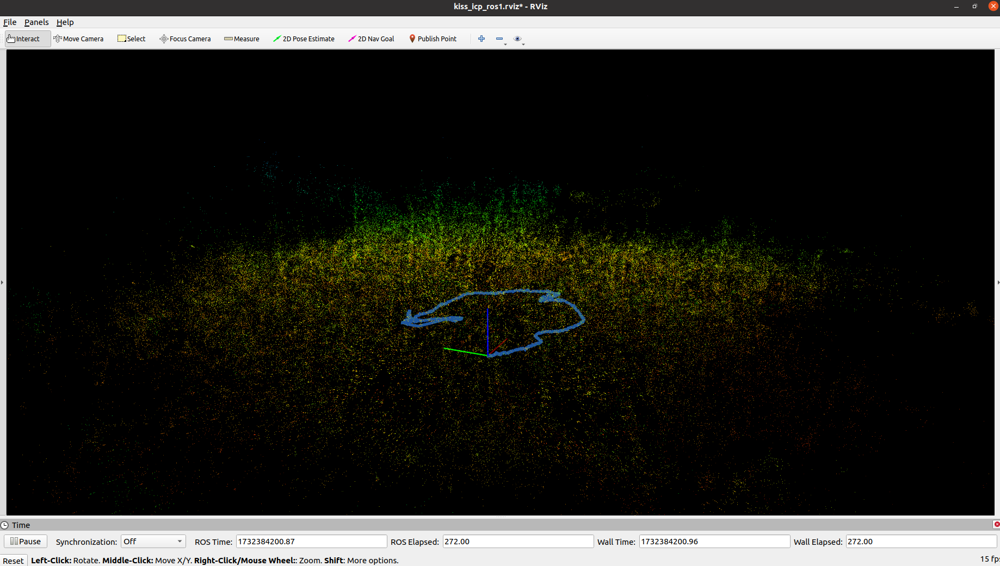
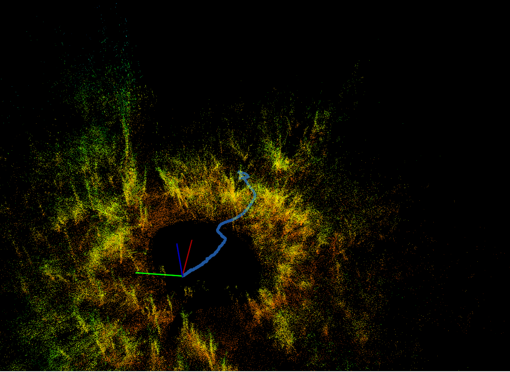

# These bags are from Robomechanics Lab box
## Hope these are test data from the Ohio Trip

```
rosbag info <bag name>
```

Chevron > ThinkPad Laptop Files > Home
- 2022-11-14-10-57-26.bag
    - /os_cloud_node/imu : sensor_msgs/Imu
    - /os_cloud_node/points : sensor_msgs/PointCloud2

Chevron > 2022 Trip Files
- 2022-11-11-14-40-33.bag
    - /os_cloud_node/imu : sensor_msgs/Imu
    - /os_cloud_node/points : sensor_msgs/PointCloud2
- 2022-11-10-14-19-57.bag
        - /os_cloud_node/imu : sensor_msgs/Imu
    - /os_cloud_node/points : sensor_msgs/PointCloud2


<!-- NOV 22 18:44 | Working on bag visualization-->
### Part 1
#### A.Visualization

```
1. roscore
2. rviz (bottom-left > add > PointCloud2 > set topic to /os_cloud_node/points)
3. rosrun tf2_ros static_transform_publisher 0 0 0 0 0 0 map os_sensor
4. rosbag play 2022-11-10-14-19-57.bag
```

2022-11-10-14-19-57.bag : is in a room<br>
2022-11-11-14-40-33.bag : traversing vegetation<br>
2022-11-14-10-57-26.bag : static in vegetation


<!-- NOV 23 | SLAM on Ohio Bags, ouster-ros bags saved in point clouds, scans, IMU-->
### Part 2
- A. KISS-ICP on Ohio Bags
- B. KISS-ICP on packets
    - Interface from packets - point clouds, etc

#### A. KISS-ICP Ohio (bag is in different format)
- topics: imu, points
- Original KISS ICP code
    - roslaunch kiss_icp odometry.launch bagfile:=/home/david/Desktop/SLAM_project/ohio_bags/2022-11-11-14-40-33.bag topic:=/point2

- Created ohio.launch in kiss-icp packet for launching ohio bags
    - rviz
    - rosrun tf2_ros static_transform_publisher 0 0 0 0 0 0 map os_sensor
    - roslaunch kiss_icp ohio.launch bagfile:=/home/david/Desktop/SLAM_project/ohio_bags/2022-11-11-14-40-33.bag topic:=/os_cloud_node/points
    - expand tab on left to adjust visualization settings

##### A. Results
- SLAM on Ohio bags work
- still need to use static_transform_publisher
- KISS-ICP maps are not as good as I thought they were going to be(?)




#### B. KISS-ICP on packets (ouster bags)
ouster-cli source bags/gazebo_scaife.bag slam viz -r2 --map

##### B. Results
- max range is way less than 100m


<!-- NOV 24 | Cost map to replicate Ohio trip results -->
### Part 3
Spent the whole day trying to figure out [intensity segmentation](intensity_seg.md) | saved each frame as .pcd and concatenate > filter > this method consumes too much memory. 
- I will replicate costmap for the Ohio trip
- Take LiDAR to phipps to get plant point cloud and analyze intensity

#### A. Cost map 
    - roscore
    - rviz
    <!-- - rosrun tf2_ros static_transform_publisher 0 0 0 0 0 0 map os_sensor -->

    - rosrun tf2_ros static_transform_publisher 0 0 0 0 0 0 1 map base_link
    <!-- - rosrun tf2_ros static_transform_publisher 0 0 0 0 0 0 1 base_link os_sensor -->
    - rosrun tf2_ros static_transform_publisher 0.1 0 0.2 0 0 0 1 base_link os_sensor


    - rosbag play 2022-11-11-14-40-33.bag
    - roslaunch costmap_2d_config costmap_2d.launch

<!-- NOV 25 | SLAM on Ohio bag first : map of unstructured environment + intensity analysis-->
pcl_ros: pointcloud2 processing
rtabmap_ros, cartographer_ros: slam packages
octomap: occupancy maps

SLAM_project/src
git clone https://github.com/introlab/rtabmap.git
cd rtabmap


sudo apt-get install ros-noetic-pcl-ros ros-noetic-rtabmap.ros

roscore
rosbag paly ohio_bags/2022-11-10-14-19-57.bag
roslaunch rtabmap_ros rtabmap.launch
rosrun rqt_reconfigure rqt_reconfigure
